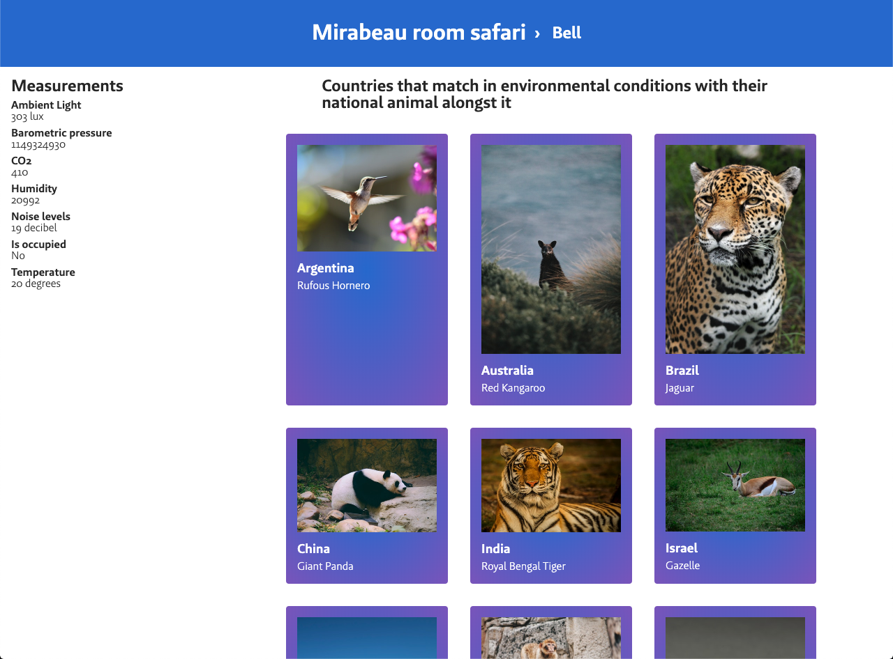
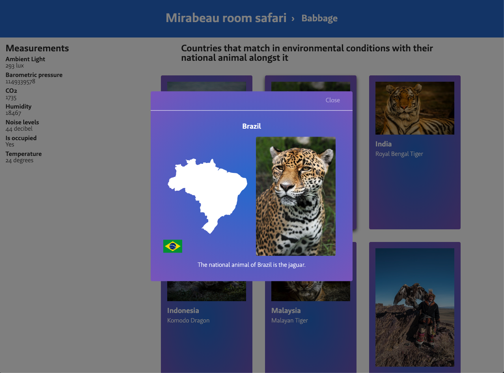
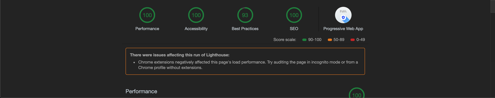

# Project 2 @cmda-minor-web · 2018-2019

[🚀 Live demo 🚀](https://cmda-minor-project-2.herokuapp.com/)

An useful server-side rendered application built with the data of Mirabeau for Mirabeau employees to make more of their day. Read more about it [here](#Concept).

## Table of Contents

1. [Installation](#Installation)
2. [Concept](#Concept)
3. [Application layers](#Application-layers)
    1. [Core functionality](#Core-functionality)
    2. [Reliable](#Reliable)
    3. [Usable](#Usable)
    4. [Pleasurable](#Pleasurable)
4. [Scores](#Scores)
5. [Features](#Features)
6. [Future enhancements](#Future-enhancements)
7. [Attribution](#Attribution)
8. [Sources](#Sources)
9. [License](#License)

## Installation

* Make sure to install [yarn](https://yarnpkg.com/en/) or [npm](https://www.npmjs.com).
* Make sure the **port** specified in the [index.ts](server/src/index.ts) is available (defaults to 3000).

* Clone the repository: `git clone git@github.com:Maikxx/project-2-1819.git`.
* Navigate into the directory: `cd project-2-1819`.
* Install dependencies: `yarn` or `npm install`.
* Start the server with: `yarn start-server` or `npm run start-server`.

The build (`yarn build`) runs the TypeScript compiler first, turning the TypeScript files into JavaScript files in the `dist` folder.
The build process will then copy the `views` folder to the `dist` folder.

## Concept

Mirabeau employees will want to see a list of all rooms that exist, and with it their statistics (like temperature) in real-time. There will be a subtle difference between rooms that are available and those that are not.

Employees can navigate to a detail page of a room, where they get to see more detailed information about the room, as well as a comparison of the environmental conditions in this room that are comparable to a list of countries at this month of the year.

With each country there is an image shown of an animal (or similar, because the Unsplash API sometimes makes mistakes) that is the national animal of that country, so the employees learn something on a day to day basis about the world, as well as see cute animals on their screens when looking for room they can sit in, which relieves stress.

When a user clicks on a specific countries card, they will be prompted with a modal (which is fully accessible both without JavaScript and Mouse/Trackpad), where a more detailed section of information is shown to the user, along with a small map representing the country.

## Application layers

### Core functionality

The core functionality of this application is to provide Mirabeau employees with useful information about their meeting rooms.

### Reliable

The employee must be able to trust the data that is presented to them.

### Usable

It must be accessible for pretty much everyone, disregarding disability, browser or internet speed.

### Pleasurable

Provide the user with additional useful features, mainly with JavaScript.

## Scores

### Overview page

### Detail page

## Features

* [(Pre-)Compression](./server/src/services/decompressionService.ts) to increase performance for the **first view**.
* [Caching](./server/src/services/memoryCache.ts) to increase performance for the **repeat view**.
* [Compile and minify](./gulpfile.js#L24) the client-side TypeScript. This reduced the **time to first byte** as well as improving the speed at which the page is **first shown**.
* [Meta description](./server/src/views/partials/head.ejs#L3) tag to increase **SEO scrore**.
* [Minify](./gulpfile.js#L11) the CSS. This reduced the **time to first byte**, as well as improving the speed at which the page is **first shown**.
* [Robots.txt](./server/public/robots.txt) to increase **SEO scrore**.
* Has an [offline page](./server/src/views/pages/offline.ejs).
* Make use of a **service worker** to view visited pages when **offline**.
* Provides all the core functionality fine without JavaScript.
* PWA standalone support.
* Server-side rendering to increase perfomance for **first view**.
* Use a web font (WOFF and WOFF2), with only a subset of all characters (only Latin).
* Use aria-label to describe to people that are using screen-readers what certain links do.
* Feature detection in JavaScript.

## Future enhancements

* Fix images that are not actually animals (for example: New Zealand, Kiwi shows a kiwi fruit instead of the bird).
* Increase performance on **first view** (caused by the size of prefetched data).
* Swap SVG maps with Mapbox map when there is JavaScript.
* Update climate data by using a weather API.

## Attribution

* [Chelsea Doeleman](https://github.com/chelseadoeleman) for helping me with the concept of the application.
* [Dennis Wegereef](https://github.com/Denniswegereef) for setting up the API on Digital Ocean.

## Sources

* [CSS-only modal](https://codepen.io/timothylong/pen/HhAer/).
* [Climate data per country](https://github.com/michaelx/climate/blob/master/climate.json). This data is unfortunately 4 years old, because I could not find newer data in this format and for calling another API I did not have time.
* [National animals per country](http://www.geocountries.com/country/national/animals).
* [Mirabeau room data](https://www.mirabeau.nl/).
* [SVG Maps](https://github.com/djaiss/mapsicon).
* [Unsplash API](https://unsplash.com/).

## License

This repository is licensed as [MIT](LICENSE) by [Maikel van Veen](https://github.com/maikxx).